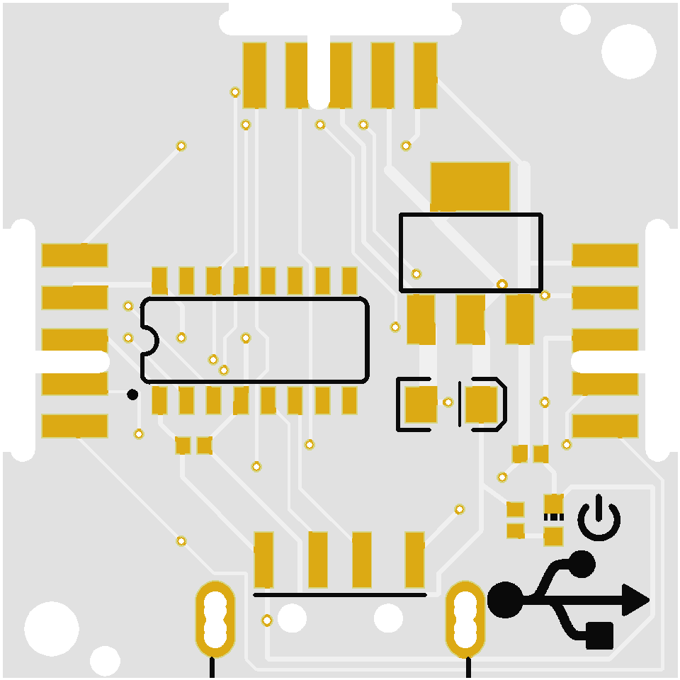

# Table of xChips

## xChips
| Name | Decription | Logo | Image  | Starter Kit | Space kit |
| -- | -- | :--:|  :--:|  :--:|:--:|
| [CWS](https://github.com/domino4com/CWS) | Standard Core| | | :heavy_check_mark: ||
| [CWV](https://github.com/domino4com/CWV) | Vertebra Core | | ||:heavy_check_mark:|
| [EBA](https://github.com/domino4com/EBA) | Extension Slot / xChips Bus Interface |  | |||
| [EL4](https://github.com/domino4com/ELx) | LoRa 433MHz|  | |||
| [EPA](https://github.com/domino4com/EPA) | Extension Prototype ADC |  |  ||:heavy_check_mark:|
| [EPB](https://github.com/domino4com/EPB) | Extension Prototype Bus |  | ||:heavy_check_mark:|
| [IGA](https://github.com/domino4com/IGA) | Air Quality Sensor | |  |||
| [IIA](https://github.com/domino4com/IIA) | Accelerometer | |  |||
| [ILB](https://github.com/domino4com/ILB) | Light Sensor | |  |:heavy_check_mark:||
| [INA](https://github.com/domino4com/INA) | GNSS (GPS & BeiDou) | |  |||
| [IPB](https://github.com/domino4com/IPB) | xBus Prototype Bus | |  |||
| [IPP](https://github.com/domino4com/IPP) | Large Prototype | |  |||
| [IWA](https://github.com/domino4com/IWA) | Weather Sensor | | |:heavy_check_mark:||
| [IWB](https://github.com/domino4com/IWB) | Barometer | |  |||
| [IWC](https://github.com/domino4com/IWC) | Soilmoisture Sensor| |  |:heavy_check_mark:||
| [ODA](https://github.com/domino4com/ODA) | Display | | |:heavy_check_mark:||
| [PLA](https://github.com/domino4com/PLA) | Battery | | |||
| [PPU](https://github.com/domino4com/PPU) | Power & Programming | | |:heavy_check_mark:||

## Kits

# License: 

Creative Commons Attribution-NonCommercial-ShareAlike 4.0 International Public License

[View License Deed](https://creativecommons.org/licenses/by-nc-sa/4.0/) | [View Legal Code](https://creativecommons.org/licenses/by-nc-sa/4.0/legalcode)
